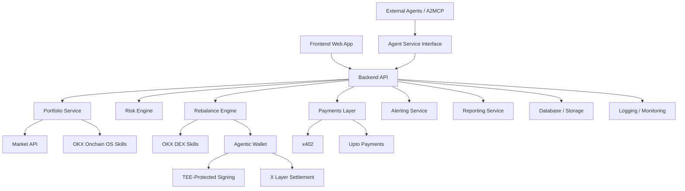

# Phylax Product Requirements Document

**Product:** Phylax  
**Positioning:** Autonomous guardian for xStocks and RWA portfolios  
**Platform:** OKX.AI, A2MCP, X Layer  
**Document status:** Product/technical PRD for hackathon MVP through production launch  
**Last updated:** 2026-07-09

## 1. Executive Summary

Phylax is an A2MCP-first Agent Service Provider on OKX.AI for xStocks and real-world asset portfolios. It acts as an autonomous guardian for agents, users, and teams managing tokenized equities, RWAs, stablecoins, and cash-like assets on X Layer.

Phylax continuously monitors portfolio holdings, detects exposure and security risks, scans dangerous approvals, generates risk and health scores, suggests safer rebalancing actions, and can optionally execute approved actions through policy-controlled flows using OKX Agentic Wallet and TEE-protected signing.

Why it matters: autonomous finance agents are beginning to manage capital, but most systems optimize for execution before they solve risk, permissions, monitoring, and accountability. Phylax provides the missing risk and security layer between intent and action.

Why now: xStocks, RWAs, agentic wallets, x402 payments, and OKX.AI-style agent services are converging. Tokenized assets introduce market, liquidity, oracle, issuer, approval, and execution risks that generic wallet dashboards do not handle well.

| Generic Portfolio Tracker | Phylax |
|---|---|
| Shows balances | Interprets portfolio risk |
| Human-facing only | Agent-readable and A2MCP-first |
| Passive analytics | Proactive alerts and guardrails |
| No execution policy | Policy-controlled execution |
| No paid agent interface | x402/Upto-enabled analysis service |
| Crypto-only mental model | Built for xStocks, RWAs, stablecoins, and agents |

## 2. Problem Statement

Autonomous agents managing tokenized capital face a trust and security vacuum. They can query data, suggest trades, and execute transactions, but they often lack an independent risk layer that checks whether an action is safe, policy-compliant, economically rational, and secure.

Tokenized equity and RWA portfolios differ from normal crypto portfolios because they combine market-session behavior, offchain pricing assumptions, fragmented liquidity, issuer/custodian dependencies, regulatory context, token wrapper risk, and agent execution risk.

Current pain points:

1. Fragmented portfolio data across wallets, market APIs, DEXs, asset registries, and settlement layers.
2. Poor visibility into concentration, liquidity, volatility, approvals, and protocol exposure.
3. Risky token approvals that users and agents may not notice until funds are exposed.
4. Delayed response to exposure spikes, market volatility, or liquidity changes.
5. Unpredictable analysis costs when agents need deeper investigation.
6. No standard agent-native way to ask, "Is this proposed portfolio action safe?"
7. No production-grade monitoring service designed specifically for agentic xStocks/RWA finance.

## 3. Product Vision

Phylax should become the default security and risk layer for autonomous capital management. Long term, it sits between users, agents, and execution infrastructure as a guardian service that monitors portfolios, evaluates proposed actions, gates risky behavior, and produces audit-ready reports.

Marketplace positioning:

| Area | Position |
|---|---|
| Category | Agent Service Provider |
| Primary use case | Security-first portfolio monitoring and execution guardrails |
| Buyer | Agents, users, teams, developers, RWA portfolio builders |
| Differentiator | A2MCP-first, paid, machine-readable risk infrastructure |

Phylax becomes infrastructure when other agents query it before trading, rebalancing, reporting, or deploying capital.

## 4. Goals & Non-Goals

### Product Goals

| Goal | Description |
|---|---|
| Portfolio visibility | Show xStocks/RWA holdings, allocation, PnL, health, and exposure. |
| Risk detection | Detect concentration, risky approvals, volatility, liquidity issues, and abnormal portfolio drift. |
| Agent-native analysis | Provide A2MCP-compatible responses for external agents. |
| Payment-gated depth | Support free basic checks and paid deep analysis through x402/Upto. |
| Safe action recommendations | Suggest and simulate rebalances before execution. |
| Trustworthy UX | Feel like a serious fintech/security product, not a demo shell. |

### Technical Goals

| Goal | Description |
|---|---|
| Modular architecture | Separate frontend, API, agent interface, risk engine, payment layer, and execution layer. |
| Policy-driven execution | Every execution request must pass policy checks. |
| Observable system | Logs, traces, audit records, metrics, and failure reporting. |
| Scalable risk engine | Support additional asset classes and scoring factors. |
| Secure by default | Non-custodial, TEE signing, consent-based execution, safe defaults. |

### Hackathon Goals

1. Demonstrate a complete incident-based flow.
2. Show wallet connection or realistic wallet simulation.
3. Show portfolio scan, risk score, alert, paid deep analysis, rebalance simulation, and agent-readable output.
4. Publish a credible GitHub repo and README.
5. Position Phylax clearly for OKX.AI marketplace submission.

### Non-Goals for MVP

| Non-Goal | Reason |
|---|---|
| Full production trading across all assets | Too large and risky for MVP. |
| Custodial asset management | Conflicts with security posture. |
| Regulatory advice | Phylax provides risk analysis, not legal or investment advice. |
| Fully automated execution without approval | Unsafe for early product. |
| Supporting every RWA asset class | MVP should focus on xStocks, stablecoins, and a small RWA set. |
| Perfect risk model | Start transparent, explainable, and tunable. |

## 5. Target Users & Personas

| Persona | Description | Primary Need |
|---|---|---|
| Autonomous Portfolio Agent | Agent managing capital or portfolio strategy. | Pre-trade risk checks and agent-readable reports. |
| Individual xStocks/RWA Investor | User holding tokenized equities, RWAs, and stablecoins. | Know whether portfolio and approvals are safe. |
| Team/DAO/Fund | Group using agentic strategies or treasury automation. | Policy-controlled monitoring and reporting. |
| Finance Agent Developer | Builder integrating risk checks into agent workflows. | API, webhooks, and A2MCP service. |
| OKX.AI Marketplace User | User browsing agent services. | A trusted ASP for portfolio safety and analysis. |

## 6. Core User Stories

| ID | User Story |
|---|---|
| US-001 | As a user, I want to connect my wallet, so that Phylax can analyze my xStocks and RWA holdings. |
| US-002 | As a user, I want to run a portfolio scan, so that I can see my allocation, risk score, and portfolio health. |
| US-003 | As a user, I want Phylax to detect risky approvals, so that I can revoke or avoid unsafe permissions. |
| US-004 | As an investor, I want to receive an exposure spike alert, so that I can react before my portfolio becomes too concentrated. |
| US-005 | As an agent, I want to request paid deep analysis via x402/Upto, so that I can get higher-confidence risk output when needed. |
| US-006 | As a user, I want to simulate a rebalance, so that I can understand the effect before executing. |
| US-007 | As a user, I want to execute a safe rebalance, so that I can reduce risk while respecting my policy settings. |
| US-008 | As another agent, I want to query Phylax before making a trade, so that I can avoid unsafe or policy-violating actions. |
| US-009 | As a team, I want to subscribe to monitoring, so that Phylax watches portfolios continuously. |
| US-010 | As a user or agent, I want to generate a report, so that I can share portfolio status and risk decisions. |

## 7. Product Lifecycle

### Phase 0: Research & Validation

| Workstream | Activities |
|---|---|
| Market research | Study xStocks/RWA users, agentic finance products, wallet risk tools, DEX aggregators, and portfolio platforms. |
| Risk research | Define xStocks/RWA-specific risks: liquidity, market hours, issuer/custodian, wrapper, volatility, slippage, pricing confidence. |
| User validation | Interview agent builders, retail users, DAO treasuries, RWA investors, and OKX.AI ecosystem participants. |
| Competitor review | Compare against portfolio trackers, wallet security scanners, DeFi risk dashboards, and agent frameworks. |
| Technical feasibility | Validate OKX.AI, A2MCP, wallet, DEX, Market API, payment, and X Layer integration paths. |

Assumption: exact OKX.AI marketplace and A2MCP submission requirements must be confirmed from official hackathon documentation.

### Phase 1: Hackathon MVP

Must build:

1. Landing page with clear positioning.
2. Dashboard with portfolio overview.
3. Wallet connection or realistic wallet simulation.
4. Portfolio scan for sample xStocks/RWA holdings.
5. Risk score and health score.
6. Incident alert: exposure spike or risky approval.
7. x402/Upto payment demo for deep analysis.
8. Rebalance simulator.
9. Agent-readable API response.
10. Marketplace-ready ASP interface description.
11. Public GitHub repo with README, architecture, setup, demo, and API examples.
12. 90-second demo video.

### Phase 2: Private Alpha

| Area | Scope |
|---|---|
| Users | Limited wallets, developers, and agents. |
| Execution | Simulated execution by default. |
| Risk validation | Compare risk output against known scenarios. |
| Feedback loop | Collect false positives, false negatives, UX confusion, and integration friction. |
| Policies | Test spending caps, blocked assets, max exposure, and approval thresholds. |

### Phase 3: Public Beta

| Area | Scope |
|---|---|
| Wallets | Real wallet support with supported networks/assets. |
| Payments | Paid analysis via x402/Upto. |
| Monitoring | Recurring scans and subscriptions. |
| Alerts | Email, webhook, in-app, and agent-readable alerts. |
| Reporting | Daily/weekly reports and exportable incident summaries. |
| Security checks | More reliable approval scanning, market confidence checks, and transaction simulation. |

### Phase 4: Production Launch

| Area | Scope |
|---|---|
| Infrastructure | Production APIs, queues, cache, database, monitoring, failover. |
| Security | Audit, threat model, secrets management, TEE signing review, rate limits. |
| Billing | Plans, usage metering, receipts, subscription lifecycle. |
| Docs | User docs, API docs, agent integration docs, policy examples. |
| Marketplace | OKX.AI listing, demo assets, categories, pricing, support links. |
| Support | Incident handling, support workflow, SLA expectations. |

### Phase 5: Scale & Expansion

1. More RWA asset classes.
2. More chains and venues where appropriate.
3. Advanced policy engine.
4. Institutional reporting.
5. Multi-portfolio and team accounts.
6. Agent reputation and safety scoring.
7. Compliance-aware reporting.
8. Agent marketplace integrations.
9. Policy templates for funds, DAOs, and individuals.

## 8. MVP Scope

| Component | MVP Requirement |
|---|---|
| Landing page | Premium fintech positioning, clear CTA, incident-first framing. |
| Dashboard | Portfolio value, 24H PnL, allocation, exposure, health status, risk score. |
| Wallet connection | Connect or simulate wallet with realistic address state. |
| Portfolio overview | Show xStocks, RWA, stablecoin, and cash-like holdings. |
| Risk score | Explainable 0-100 risk score. |
| Health score | Explainable 0-100 health score. |
| Alert cards | Exposure Spike, Risky Approval, Liquidity Shift, Rebalance Suggested. |
| Rebalance simulator | Show before/after allocation, expected risk reduction, slippage estimate. |
| x402/Upto demo | Payment gate before deeper analysis. |
| Agent API response | JSON response designed for another agent to consume. |
| ASP interface | `/agent/query` endpoint and README contract. |
| Demo incident | Portfolio becomes overexposed to one xStock and has risky spender approval. |

## 9. Post-MVP Scope

| Feature | Description |
|---|---|
| Real-time monitoring | Scheduled scans, webhooks, and alert delivery. |
| Real execution | DEX swaps with transaction simulation and user confirmation. |
| Approval revocation | Recommend and support safe revocation flows. |
| Portfolio policy templates | Conservative, balanced, aggressive, treasury, agent-managed. |
| Advanced risk models | Better liquidity, volatility, pricing confidence, issuer, and protocol scoring. |
| Team accounts | Shared dashboards, audit logs, roles, and policies. |
| Multi-wallet | Aggregate wallets into one portfolio. |
| API keys | Developer access and usage limits. |
| Billing portal | Subscriptions, usage history, invoices, plan management. |
| Compliance-aware reports | Exportable reports for teams and funds. |

## 10. Functional Requirements

| ID | Requirement | Priority |
|---|---|---|
| FR-001 | User can connect a wallet or select demo wallet. | P0 |
| FR-002 | System fetches or simulates portfolio balances. | P0 |
| FR-003 | System calculates portfolio allocation by asset and category. | P0 |
| FR-004 | System calculates portfolio value and 24H PnL. | P0 |
| FR-005 | System calculates risk score. | P0 |
| FR-006 | System calculates health score. | P0 |
| FR-007 | System scans approvals for risky spenders. | P0 |
| FR-008 | System generates alert cards. | P0 |
| FR-009 | System detects concentration risk. | P0 |
| FR-010 | System detects liquidity or market risk from available data. | P0 |
| FR-011 | System simulates rebalance actions. | P0 |
| FR-012 | System displays before/after risk and allocation. | P0 |
| FR-013 | System requests payment before deep analysis. | P0 |
| FR-014 | System supports x402/Upto-style paid analysis demo. | P0 |
| FR-015 | System returns agent-readable JSON report. | P0 |
| FR-016 | System logs analysis history. | P1 |
| FR-017 | System supports webhook alert delivery. | P1 |
| FR-018 | System supports monitoring subscriptions. | P1 |
| FR-019 | System supports policy configuration. | P1 |
| FR-020 | System blocks execution if policy fails. | P1 |
| FR-021 | System executes rebalance after simulation and approval. | P2 for MVP, P0 for beta |
| FR-022 | System exports reports. | P1 |
| FR-023 | System exposes API docs. | P0 |
| FR-024 | System provides marketplace-ready service metadata. | P0 |

## 11. Non-Functional Requirements

| Category | Requirement |
|---|---|
| Security | Non-custodial by default, policy-controlled execution, TEE signing, audit logs, secrets management. |
| Reliability | Portfolio scans should fail gracefully with partial data. |
| Latency | Basic scan target: under 3 seconds for cached/demo data, under 10 seconds for live data. |
| Scalability | Risk engine should support async jobs for deep analysis. |
| Observability | Logs, metrics, traces, payment events, scan outcomes, execution decisions. |
| Error handling | Clear user-facing errors and machine-readable agent errors. |
| Data freshness | Display freshness timestamp and confidence level. |
| Privacy | Minimize stored wallet/user data; avoid storing private keys or secrets. |
| Maintainability | Modular services with typed API contracts. |
| UX quality | Premium fintech UI, clear risk explanations, no vague warnings. |
| Production readiness | Rate limits, retries, monitoring, backup, billing records, documentation. |

## 12. System Architecture



| Component | Responsibility |
|---|---|
| Frontend | Landing, dashboard, alerts, simulator, billing, docs, settings. |
| Backend/API | Auth, wallet session, portfolio data, scans, reports, payments, policies. |
| Agent orchestration | Accepts agent queries, validates request, routes tools, returns machine-readable output. |
| OKX Onchain OS skills | Onchain data, wallet, token, transaction, and ecosystem actions. |
| Agentic Wallet | Secure wallet interaction and signing flow. |
| Market API | Prices, volatility, liquidity, and market data. |
| Risk engine | Scores market, liquidity, concentration, approval, protocol, and execution risk. |
| Rebalance engine | Generates safe target allocations and simulations. |
| Payments layer | x402, Upto, subscriptions, usage metering. |
| Database | Users, wallets, portfolios, alerts, reports, payment sessions, policies. |
| Alerting | In-app alerts, webhooks, future email/Telegram/agent callbacks. |
| Monitoring | Logs, metrics, traces, audit events, incident visibility. |
| External agent interface | A2MCP-compatible API and response schema. |

## 13. Agent Architecture

Phylax behaves as an Agent Service Provider that other agents query before they trade, rebalance, or report.

Primary operation: `POST /agent/query`

Supported intents:

| Intent | Description |
|---|---|
| `portfolio.scan` | Basic portfolio risk scan. |
| `approval.scan` | Approval and spender risk scan. |
| `risk.deep_analysis` | Paid deeper risk analysis. |
| `rebalance.simulate` | Simulate safer allocation. |
| `execution.preflight` | Check whether a proposed action is safe. |
| `report.generate` | Generate agent-readable portfolio report. |

Agent-to-agent request flow:

1. External agent sends request with wallet, intent, policy context, and proposed action.
2. Phylax validates schema and authentication.
3. Phylax estimates analysis depth and cost.
4. If paid depth is required, Phylax returns payment requirement.
5. Agent completes x402/Upto payment.
6. Phylax runs tool calls and risk checks.
7. Phylax returns JSON with recommendation, score, confidence, and blockers.
8. If execution is requested, Phylax requires policy pass and explicit approval.

Failure handling:

| Failure | Response |
|---|---|
| Invalid request | Return `400` with schema error. |
| Payment required | Return `402` with payment session details. |
| Unsupported asset | Return partial scan with unsupported asset warning. |
| Low confidence | Return result with `confidence: low` and recommended next step. |
| Policy violation | Return `blocked: true` with reason. |
| Execution failure | Return no transaction broadcast and full failure reason. |

## 14. Data Model

| Entity | Key Fields |
|---|---|
| User | `id`, `email`, `createdAt`, `plan`, `status`, `preferences` |
| Wallet | `id`, `userId`, `address`, `chainId`, `label`, `connectionType`, `createdAt` |
| Portfolio | `id`, `walletId`, `totalValueUsd`, `pnl24hUsd`, `pnl24hPct`, `riskScoreId`, `healthScoreId`, `lastScannedAt` |
| Asset | `id`, `symbol`, `name`, `contractAddress`, `chainId`, `category`, `issuer`, `riskMetadata` |
| Holding | `id`, `portfolioId`, `assetId`, `quantity`, `valueUsd`, `allocationPct`, `costBasisUsd`, `pnlUsd`, `pnlPct` |
| RiskScore | `id`, `portfolioId`, `score`, `level`, `factors`, `confidence`, `createdAt` |
| HealthScore | `id`, `portfolioId`, `score`, `status`, `drivers`, `createdAt` |
| Alert | `id`, `portfolioId`, `type`, `severity`, `title`, `description`, `recommendedAction`, `status`, `createdAt` |
| RebalanceSimulation | `id`, `portfolioId`, `inputAllocation`, `targetAllocation`, `estimatedSlippage`, `estimatedFeesUsd`, `riskBefore`, `riskAfter`, `healthBefore`, `healthAfter`, `status` |
| PaymentSession | `id`, `userId`, `agentRequestId`, `type`, `amountMax`, `amountCharged`, `currency`, `status`, `expiresAt` |
| Report | `id`, `portfolioId`, `type`, `summary`, `findings`, `recommendations`, `createdAt` |
| AgentRequest | `id`, `requestingAgentId`, `intent`, `walletAddress`, `payload`, `paymentSessionId`, `status`, `createdAt` |
| Policy | `id`, `userId`, `walletId`, `maxSingleAssetExposurePct`, `maxSlippagePct`, `blockedAssets`, `allowedActions`, `dailySpendCapUsd`, `requiresApprovalAboveUsd`, `createdAt` |

## 15. API Design

### `GET /portfolio/overview`

```json
{
  "walletAddress": "0x742d...44e",
  "chainId": "xlayer-mainnet",
  "totalValueUsd": 48250.42,
  "pnl24hUsd": -840.12,
  "pnl24hPct": -1.71,
  "riskScore": {
    "score": 74,
    "level": "high",
    "confidence": "medium"
  },
  "healthScore": {
    "score": 61,
    "status": "watch"
  },
  "lastScannedAt": "2026-07-09T10:30:00Z"
}
```

### `GET /portfolio/holdings`

```json
{
  "holdings": [
    {
      "symbol": "TSLAx",
      "category": "xstock",
      "quantity": "42.5",
      "valueUsd": 18240.12,
      "allocationPct": 37.8,
      "pnl24hPct": -4.2,
      "riskLevel": "high"
    }
  ]
}
```

### `POST /risk/scan`

```json
{
  "walletAddress": "0x742d...44e",
  "depth": "basic",
  "includeApprovals": true
}
```

```json
{
  "riskScore": 74,
  "level": "high",
  "confidence": "medium",
  "factors": {
    "marketRisk": 68,
    "liquidityRisk": 72,
    "concentrationRisk": 86,
    "approvalRisk": 79,
    "executionRisk": 55
  },
  "alerts": [
    {
      "type": "exposure_spike",
      "severity": "high",
      "title": "TSLAx exposure exceeds policy limit",
      "recommendedAction": "Reduce TSLAx allocation from 37.8% to below 25%."
    }
  ]
}
```

### `POST /approvals/scan`

```json
{
  "walletAddress": "0x742d...44e",
  "chainId": "xlayer-mainnet"
}
```

```json
{
  "riskyApprovals": [
    {
      "asset": "USDC",
      "spender": "0x9ab...991",
      "allowance": "unlimited",
      "riskLevel": "critical",
      "reason": "Unknown spender with unlimited stablecoin approval."
    }
  ],
  "recommendedActions": [
    "Revoke unlimited USDC approval for 0x9ab...991."
  ]
}
```

### `POST /rebalance/simulate`

```json
{
  "walletAddress": "0x742d...44e",
  "strategy": "defensive",
  "constraints": {
    "maxSingleAssetExposurePct": 25,
    "minStablecoinPct": 20,
    "maxSlippagePct": 0.5
  }
}
```

```json
{
  "simulationId": "sim_123",
  "riskBefore": 74,
  "riskAfter": 49,
  "healthBefore": 61,
  "healthAfter": 78,
  "estimatedFeesUsd": 18.42,
  "estimatedSlippagePct": 0.21,
  "actions": [
    {
      "type": "swap",
      "from": "TSLAx",
      "to": "USDC",
      "amountUsd": 6200,
      "reason": "Reduce concentration risk."
    }
  ],
  "executionAllowed": true
}
```

### `POST /rebalance/execute`

```json
{
  "simulationId": "sim_123",
  "walletAddress": "0x742d...44e",
  "approvalMode": "user_confirmed"
}
```

```json
{
  "status": "pending_signature",
  "policyCheck": "passed",
  "transactionRequest": {
    "chainId": "xlayer-mainnet",
    "requiresTeeSigning": true
  }
}
```

### `POST /agent/query`

```json
{
  "requestingAgentId": "agent_portfolio_manager_01",
  "intent": "execution.preflight",
  "walletAddress": "0x742d...44e",
  "proposedAction": {
    "type": "swap",
    "from": "USDC",
    "to": "TSLAx",
    "amountUsd": 10000
  },
  "policy": {
    "maxSingleAssetExposurePct": 30,
    "maxSlippagePct": 0.5
  }
}
```

```json
{
  "decision": "blocked",
  "reason": "Proposed trade would increase TSLAx allocation to 52.4%, exceeding policy limit.",
  "riskScoreBefore": 74,
  "riskScoreAfter": 89,
  "confidence": "high",
  "recommendedAlternative": {
    "type": "no_trade",
    "explanation": "Maintain current exposure or reduce TSLAx allocation."
  }
}
```

### `POST /payments/session`

```json
{
  "type": "upto",
  "purpose": "risk.deep_analysis",
  "walletAddress": "0x742d...44e",
  "maxAmount": "3.00",
  "currency": "USDC"
}
```

```json
{
  "paymentSessionId": "pay_123",
  "status": "requires_approval",
  "maxAmount": "3.00",
  "currency": "USDC",
  "expiresAt": "2026-07-09T11:00:00Z"
}
```

Additional endpoints:

| Endpoint | Purpose |
|---|---|
| `GET /reports/:id` | Fetch report. |
| `GET /alerts` | Fetch alert list. |
| `POST /webhooks` | Register alert webhook. |

## 16. Risk Scoring Model

Phylax uses a 0-100 risk score, where higher means riskier.

| Factor | Weight | Description |
|---|---:|---|
| Market risk | 15% | Price movement, drawdown, market sensitivity. |
| Liquidity risk | 15% | Depth, spread, slippage, venue availability. |
| Concentration risk | 20% | Exposure to one asset, sector, issuer, or category. |
| Counterparty/protocol risk | 15% | Issuer, wrapper, protocol, bridge, or custodian assumptions. |
| Approval risk | 15% | Unlimited approvals, unknown spenders, risky permissions. |
| Volatility risk | 10% | Short-term price instability. |
| Execution risk | 5% | Swap failure, slippage, stale route, policy mismatch. |
| Data confidence | 5% | Freshness and completeness of data. |

High-level calculation:

```text
riskScore = weighted_sum(factorScores) adjusted by confidencePenalty
```

Risk bands:

| Score | Level | Meaning |
|---:|---|---|
| 0-30 | Low | Portfolio appears stable and policy-compliant. |
| 31-60 | Medium | Some risk exists; monitoring recommended. |
| 61-80 | High | Action or deeper analysis recommended. |
| 81-100 | Critical | Unsafe condition detected; execution should be blocked or require explicit approval. |

## 17. Rebalancing Logic

Inputs:

| Input | Description |
|---|---|
| Current holdings | Assets, values, allocations. |
| Risk scores | Portfolio and asset-level risk. |
| Market data | Price, volatility, liquidity, slippage. |
| User policy | Max exposure, min stablecoin, blocked assets, spending caps. |
| Strategy | Defensive, balanced, momentum, mean reversion, custom. |
| Fees | Estimated gas, DEX fees, spread, slippage. |

Constraints:

1. Do not exceed max single-asset exposure.
2. Do not trade blocked assets.
3. Do not exceed max slippage.
4. Do not execute if market data is stale.
5. Do not execute if payment, policy, or approval fails.
6. Do not execute without user/agent authorization.
7. Prefer minimal changes that reduce risk.

Simulation outputs before/after allocation, risk score, health score, fees, slippage, required actions, policy result, and confidence level.

Execution checks refresh balances and market data, re-run policy, simulate transaction, check approval requirements, confirm authorization, sign through Agentic Wallet/TEE, and broadcast only if all checks pass.

## 18. Payments & Monetization

| Mode | Description |
|---|---|
| Free basic scan | Basic portfolio overview, risk score, limited alerts. |
| Pay-per-query | Agents pay per deep analysis or preflight check. |
| Upto payment | User/agent approves max spend for variable-depth analysis. |
| Subscription | Recurring monitoring, reports, alerts, and usage quota. |
| Usage billing | Teams and agents pay by scan volume, monitored wallets, or API calls. |
| Agent-to-agent payment | External agents pay Phylax before receiving premium analysis. |
| ERC-20 payments | Support stablecoin-based payment where applicable. |

Example tiers:

| Tier | Audience | Includes |
|---|---|---|
| Free | Individual users | Basic scan, limited alerts, demo reports. |
| Pro | Active investors | Monitoring, deep analysis credits, reports, alert center. |
| Agent | Autonomous agents | API access, x402, webhooks, preflight checks. |
| Team | DAOs/funds/builders | Multi-wallet, policies, audit logs, team billing. |
| Enterprise | Institutions | SLA, custom policies, compliance reporting, dedicated support. |

Billing UX must show plan, cycle usage, paid analysis history, spending caps, payment status, and explicit consent before charges.

## 19. Security Model

| Security Area | Requirement |
|---|---|
| TEE-protected signing | Execution uses Agentic Wallet with TEE-protected signing where available. |
| Non-custodial design | Phylax never stores private keys. |
| Approval scanning | Detect unlimited approvals, unknown spenders, abnormal allowances. |
| Policy-based execution | Actions must satisfy configured policies. |
| Allowlisted actions | MVP only allows approved action types such as scan, simulate, report, and guarded rebalance. |
| Transaction simulation | Simulate before execution. |
| Rate limits | Protect APIs from abuse and payment bypass attempts. |
| Audit logs | Record scans, payments, decisions, policy blocks, and execution attempts. |
| Secrets management | Store API keys and signing-related secrets in secure infrastructure. |
| Abuse prevention | Detect spam agents, malformed requests, repeated failed payments, and suspicious behavior. |
| User consent | Require explicit confirmation for paid actions and execution. |
| Safe defaults | No automatic execution in MVP; block on low confidence or critical risk. |

## 20. UX / UI Requirements

Brand direction: premium fintech, spade-inspired, security-first, restrained, serious, not generic crypto.

Dark palette:

```css
--background: #0B1110;
--surface: #121A17;
--surface-soft: #1A241F;
--primary: #7EBC89;
--primary-soft: #C1DBB3;
--accent: #FE5D26;
--warning: #F2C078;
--text-main: #FAEDCA;
--text-muted: #C1DBB3;
--border: rgba(193, 219, 179, 0.18);
```

Required screens:

| Screen | Requirements |
|---|---|
| Landing Page | Clear positioning, product credibility, primary CTA, incident-based value prop. |
| Dashboard | Portfolio value, PnL, risk score, health score, alert summary, scan status. |
| Portfolio Overview | Holdings table, allocation chart, category exposure, asset-level risk. |
| Alert Center | Incident list, severity, status, recommended actions. |
| Rebalance Simulator | Strategy controls, before/after allocation, risk reduction, cost estimate. |
| Billing/Usage | Plan, usage, payment sessions, spend caps, subscriptions. |
| Agent/API Docs | Endpoint examples, response schemas, payment flow, integration guide. |
| Settings/Policies | Max exposure, slippage, blocked assets, execution approval, notification settings. |

UX principles: clear severity labels, factor breakdowns, data freshness, confidence indicators, explicit payment gates, visible agent-readable output, dark/light mode, and premium visual language.

## 21. Demo Flow

| Time | Scene |
|---:|---|
| 0-10s | Open landing page. Message: "Autonomous guardian for xStocks and RWA portfolios." |
| 10-20s | Connect wallet or select demo agent wallet. Dashboard loads portfolio. |
| 20-30s | Phylax scans holdings and shows risk score 74/high, health 61/watch. |
| 30-40s | Incident appears: "Exposure Spike: TSLAx is 37.8% of portfolio" plus "Risky Approval: unlimited USDC spender." |
| 40-50s | User/agent clicks "Run Deep Analysis." Phylax requests x402/Upto payment with max spend. |
| 50-60s | Payment approved. Deep analysis identifies concentration, liquidity, and approval risk. |
| 60-75s | Phylax recommends defensive rebalance: reduce TSLAx, increase USDC/RWA basket. |
| 75-85s | Simulator shows risk score improving from 74 to 49 and health from 61 to 78. |
| 85-90s | Final report appears with agent-readable JSON: `decision: recommended`, `executionAllowed: true`, `policyCheck: passed`. |

## 22. Success Metrics

| Metric | Definition |
|---|---|
| Number of scans | Total portfolio scans completed. |
| Paid analysis conversion | Percent of users/agents who approve deep analysis. |
| Alert accuracy | Percent of alerts marked useful or validated. |
| Rebalance simulation usage | Percent of scans that lead to simulation. |
| Risk reduction | Average score reduction after simulated or executed action. |
| Health improvement | Average health score improvement. |
| Time to detect risk | Time from scan start to alert generation. |
| Time to generate report | Time from request to report available. |
| Agent API usage | Number of external agent queries. |
| Retention | Users/agents returning weekly. |
| Revenue | Payment volume, subscription revenue, usage billing. |
| Policy block rate | Percent of unsafe actions blocked. |
| False positive rate | Alerts dismissed as irrelevant. |

## 23. Edge Cases & Failure States

| Edge Case | Expected Behavior |
|---|---|
| Wallet connection fails | Show retry, supported wallets, and demo wallet option. |
| API unavailable | Show degraded state and last known scan. |
| Market data stale | Mark confidence low and block execution. |
| Payment fails | Do not run paid analysis; show reason and retry. |
| User rejects payment | Return to basic analysis without penalty. |
| Insufficient balance | Block payment or execution with clear message. |
| Swap simulation fails | Do not execute; recommend manual review. |
| Asset unsupported | Include asset but mark as unsupported with low confidence. |
| Token flagged as risky | Increase risk score and recommend avoiding execution. |
| Agent sends malformed request | Return schema error with expected fields. |
| Risk engine has low confidence | Require deep analysis or human confirmation. |
| Execution blocked by policy | Return blocker reason and safe alternative. |
| Approval scan unavailable | Continue scan but mark approval confidence unknown. |
| User disconnects wallet | Stop live updates and preserve prior report if allowed. |
| High volatility during execution | Re-run simulation or block transaction. |

## 24. Roadmap

### 48-Hour Hackathon Roadmap

| Time | Scope |
|---|---|
| Day 1 AM | Product framing, repo setup, architecture, design system, mock data model. |
| Day 1 PM | Landing, dashboard, wallet/demo state, portfolio overview, risk score. |
| Day 2 AM | Alerts, approval scan mock, rebalance simulator, payment gate demo. |
| Day 2 PM | Agent API response, README, marketplace docs, demo script, deployment. |

### 1-Week Roadmap

1. Replace mocks with initial live APIs where feasible.
2. Add persistent scan history.
3. Add webhook prototype.
4. Improve risk scoring.
5. Add API documentation.
6. Add tests for risk and rebalance logic.
7. Improve mobile responsiveness.

### 1-Month Roadmap

1. Private alpha.
2. Real wallet support.
3. More robust approval scanning.
4. Real x402/Upto payment flow.
5. Monitoring subscriptions.
6. Report generation.
7. Basic policy engine.
8. Logging and observability.

### 3-Month Roadmap

1. Public beta.
2. Real rebalance execution with approval.
3. Team accounts.
4. API keys.
5. Developer dashboard.
6. Alert webhooks.
7. Security review.
8. Expanded asset coverage.

### 6-Month Roadmap

1. Production launch.
2. Institutional features.
3. Advanced policy engine.
4. Compliance-aware reporting.
5. Multi-portfolio support.
6. Agent marketplace integrations.
7. Third-party risk intelligence feeds.
8. Formal audit.

## 25. Engineering Task Breakdown

| Workstream | Ticket | Priority |
|---|---|---|
| Frontend | Build design system and theme tokens. | P0 |
| Frontend | Build landing page. | P0 |
| Frontend | Build dashboard shell. | P0 |
| Frontend | Build portfolio overview components. | P0 |
| Frontend | Build alert center. | P0 |
| Frontend | Build rebalance simulator UI. | P0 |
| Frontend | Build billing/usage page. | P1 |
| Frontend | Build agent docs page. | P0 |
| Frontend | Build settings/policies page. | P1 |
| Backend | Create API service. | P0 |
| Backend | Implement portfolio overview, holdings, risk scan, approvals scan, and report endpoints. | P0 |
| Backend | Add request validation and structured errors. | P0 |
| Agent Service | Implement `/agent/query`. | P0 |
| Agent Service | Define agent-readable response schema. | P0 |
| Agent Service | Add intent routing, payment-required path, and policy result. | P0 |
| Payments | Implement payment session model. | P0 |
| Payments | Build x402/Upto payment demo. | P0 |
| Payments | Add spend cap UX and payment history. | P1 |
| Risk Engine | Define factor scoring model. | P0 |
| Risk Engine | Implement concentration, approval, liquidity, and confidence scoring. | P0 |
| Rebalance Engine | Implement defensive strategy and before/after allocation. | P0 |
| Rebalance Engine | Estimate fees/slippage and add policy checks. | P0 |
| Integrations | Add OKX.AI, OKX Onchain OS, Market API, Agentic Wallet, and DEX adapter interfaces. | P0/P1 |
| Database | Define schema and persist scan history, alerts, payments, and policies. | P0/P1 |
| Testing | Unit test scoring and simulation; QA demo flow and responsive UI. | P0/P1 |
| Docs | README, architecture diagram, API docs, agent integration guide, marketplace description. | P0 |
| Deployment | Deploy frontend/API, document env vars, add health endpoint. | P0/P1 |
| Demo Prep | Write 90-second script, prepare incident scenario, record demo, create screenshots. | P0 |

## 26. Acceptance Criteria

### Hackathon MVP Done

1. User can open deployed Phylax app.
2. Landing page clearly explains autonomous xStocks/RWA guardian positioning.
3. Demo wallet loads realistic portfolio.
4. Dashboard shows value, PnL, allocation, risk score, and health score.
5. Phylax detects at least one incident.
6. Payment gate appears before deep analysis.
7. Rebalance simulator shows before/after improvement.
8. Agent-readable JSON response is available.
9. README explains setup, architecture, API, and demo flow.
10. 90-second incident-based demo is recorded.

### Marketplace Listing Done

1. Clear service name, category, and description.
2. Defined A2MCP/agent interface.
3. Pricing model described.
4. API examples included.
5. Security model documented.
6. Demo video and screenshots included.
7. Repository is public and reproducible.

### Production Beta Done

1. Real wallet support.
2. Live or semi-live portfolio data.
3. Real payment sessions.
4. Persistent scan history.
5. Monitoring subscriptions.
6. Webhook alerts.
7. Policy engine.
8. Basic execution preflight.
9. Observability and error handling.
10. Security review completed.

### Production Launch Done

1. Production infrastructure.
2. Audited execution flow.
3. Reliable billing.
4. Customer support process.
5. Full API docs.
6. Marketplace listing live.
7. Incident response plan.
8. SLA targets defined.
9. Team accounts and audit logs.
10. Security and privacy documentation.

## 27. Risks & Mitigations

| Risk Type | Risk | Mitigation |
|---|---|---|
| Product | Too broad for hackathon. | Build incident-based MVP with mocked adapters and real architecture. |
| Technical | Integrations may be incomplete or unclear. | Use adapter interfaces and document assumptions. |
| Security | Execution flow could be unsafe. | MVP uses simulation; execution gated by policy and explicit approval. |
| UX | Users may not understand risk score. | Show factor breakdown and recommended actions. |
| Market | Users may see this as another dashboard. | Lead with guardian, alerts, agent API, and policy-controlled execution. |
| Hackathon | Demo may feel static. | Use incident narrative with payment and simulation. |
| Data | Market data may be stale or unavailable. | Show confidence and freshness; block execution on stale data. |
| Payments | x402/Upto integration may be hard in time. | Build faithful payment-session demo with clean interface. |
| Trust | Risk model may be questioned. | Make scoring transparent and explainable. |
| Compliance | RWA/tokenized equity claims may imply advice. | Use risk analysis language, not financial advice. |

## 28. Open Questions

Assumptions:

1. X Layer is the primary settlement target for MVP.
2. MVP can use simulated xStocks/RWA portfolio data if live data is not available in time.
3. OKX.AI marketplace supports ASP-style listings with agent-readable service interfaces.
4. x402/Upto can be represented in MVP through a payment-session abstraction if full integration is not feasible.
5. Execution is optional for hackathon MVP and can remain simulated.

Questions to validate:

1. What are the exact OKX.AI marketplace submission requirements?
2. What A2MCP schema conventions should Phylax follow?
3. Which xStocks and RWA assets are officially supported in the hackathon environment?
4. Which Market API endpoints are available for price, liquidity, and volatility?
5. What is the recommended Agentic Wallet integration path?
6. What are the required payment flows for x402 and Upto?
7. Can Phylax revoke approvals directly, or only recommend revocation?
8. What data can be cached, and for how long?
9. What compliance disclaimers are required for tokenized equity/RWA analysis?
10. What execution permissions are acceptable for marketplace review?

## 29. Final Recommendation

Build the hackathon MVP around one strong incident: Phylax detects that an agent-managed xStocks/RWA portfolio has become dangerously concentrated and also has a risky stablecoin approval.

The first version should include:

1. Premium landing page.
2. Demo wallet portfolio.
3. Dashboard with risk and health scores.
4. Alert center showing exposure spike and risky approval.
5. Payment-gated deep analysis via x402/Upto-style flow.
6. Rebalance simulator showing measurable risk reduction.
7. Agent-readable `/agent/query` response.
8. README and marketplace-ready documentation.

Do not spend hackathon time trying to support every asset, every wallet, or fully automated execution. The winning version should prove the core thesis: before autonomous agents move tokenized capital, they should ask Phylax whether the action is safe.
