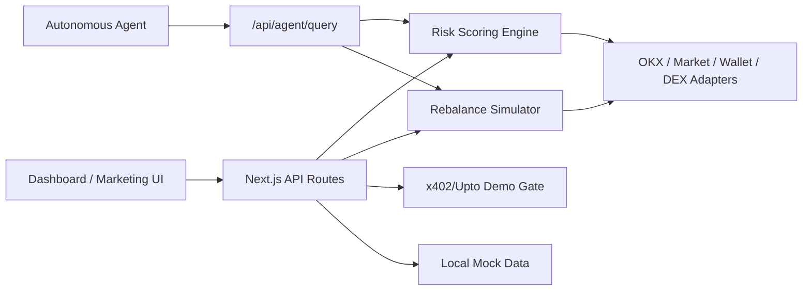

# Phylax

Phylax is an A2MCP-first Agent Service Provider for OKX.AI: an autonomous guardian for xStocks and real-world asset portfolios.

It monitors holdings, detects portfolio and security risks, scans dangerous approvals, produces risk and health scores, suggests safer rebalance actions, gates deep analysis behind an x402/Upto-style payment flow, and exposes agent-readable APIs before autonomous systems move tokenized capital.

> Current MVP uses safe mocks and typed adapter stubs. No real private keys, payments, or trades are used.

## What Phylax Does

- Portfolio monitoring for xStocks, RWAs, stablecoins, and cash-like assets.
- Risk scoring across market, liquidity, concentration, counterparty, approvals, volatility, execution, and data confidence.
- Approval scanning for dangerous allowances like unlimited USDC approvals.
- Rebalance simulation with defensive, balanced, momentum, mean-reversion, and custom strategy modes.
- Agent preflight checks through `/api/agent/query`.
- Simulated x402/Upto payment sessions for deep analysis.
- Production-oriented adapter boundaries for OKX OnchainOS, Agentic Wallet, market data, and DEX execution.

## Why It Matters

Before autonomous agents move tokenized capital, they should ask a trusted risk layer whether the action is safe. Phylax makes that check machine-readable, payment-aware, policy-controlled, and easy to embed in agent workflows.

## Demo Flow

1. Open `/` for the premium marketing website.
2. Launch `/dashboard` to see the incident scenario.
3. Show TSLA.x at 37.8% allocation and the risky unlimited USDC approval.
4. Click `Run Deep Analysis` in the billing card and approve the simulated Upto cap.
5. Open `/dashboard/rebalance` to show risk improving from 74 to 49.
6. Open `/dashboard/docs` and show `/api/agent/query`.
7. Call the agent endpoint to prove another agent can receive a blocked/recommended decision.

## Architecture



## Tech Stack

- Next.js 15 App Router
- React 19
- TypeScript strict mode
- Tailwind CSS
- Native light/dark mode toggle using the Phylax CSS token system
- lucide-react icons
- SVG data visualizations
- Zod-style local validation shim for demo-safe route validation
- Local mock data and typed integration adapters

## Setup

```bash
npm install
npm run dev
```

Open [http://localhost:3000](http://localhost:3000).

Useful commands:

```bash
npm run typecheck
npm run build
npm run lint
npm run test
```

## Environment Variables

Copy `.env.example` to `.env.local` for local development.

```bash
NEXT_PUBLIC_APP_URL=http://localhost:3000
NEXT_PUBLIC_DEMO_MODE=true
OKX_ONCHAINOS_API_KEY=
OKX_MARKET_API_KEY=
OKX_AGENTIC_WALLET_CLIENT_ID=
X402_PROVIDER_URL=
X402_MERCHANT_ADDRESS=
UPTO_PAYMENT_CONTRACT=
DATABASE_URL=
```

## API Endpoints

- `GET /api/portfolio/overview`
- `GET /api/portfolio/holdings`
- `POST /api/risk/scan`
- `POST /api/approvals/scan`
- `POST /api/rebalance/simulate`
- `POST /api/rebalance/execute`
- `POST /api/payments/session`
- `POST /api/agent/query`
- `GET /api/reports/:id`
- `GET /api/alerts`
- `POST /api/webhooks`

## Agent Service Interface

`POST /api/agent/query` supports:

- `portfolio.scan`
- `approval.scan`
- `risk.deep_analysis`
- `rebalance.simulate`
- `execution.preflight`
- `report.generate`

Example:

```json
{
  "requestingAgentId": "agent_portfolio_manager_01",
  "intent": "execution.preflight",
  "walletAddress": "0x742d...44e",
  "proposedAction": {
    "type": "swap",
    "from": "USDC",
    "to": "TSLAx",
    "amountUsd": 10000
  },
  "policy": {
    "maxSingleAssetExposurePct": 30,
    "maxSlippagePct": 0.5
  }
}
```

## x402/Upto Payment Demo

Deep analysis is payment-gated in the product and API. The MVP simulates a Upto cap:

- Purpose: `risk.deep_analysis`
- Max spend: `3.00 USDC`
- Estimated final charge: `1.20 - 2.80 USDC`
- Demo settled charge: `1.84 USDC`

No real onchain payment occurs.

## OKX / OnchainOS Integration Plan

Real integrations can replace the stubs in `lib/integrations`:

- `okx-onchainos-adapter.ts`
- `agentic-wallet-adapter.ts`
- `market-api-adapter.ts`
- `dex-adapter.ts`

The MVP already separates portfolio data, token risk, market data, transaction simulation, policy checks, TEE signing placeholders, quotes, swaps, and execution boundaries.

## Security Model

- Non-custodial by design.
- Never store or request private keys.
- Execution is simulated unless a real Agentic Wallet integration is configured.
- Policy checks gate any future execution.
- Allowlisted execution and audit logs are first-class product concepts.
- Phylax provides risk analysis, not financial advice.

## Risk Scoring Model

Risk score is 0-100, higher is riskier:

- Market risk: 15%
- Liquidity risk: 15%
- Concentration risk: 20%
- Counterparty/protocol risk: 15%
- Approval risk: 15%
- Volatility risk: 10%
- Execution risk: 5%
- Data confidence: 5%

Bands:

- 0-30: Low
- 31-60: Medium
- 61-80: High
- 81-100: Critical

## Rebalance Logic

The simulator models before/after allocation, risk, health, fees, slippage, execution allowance, policy result, and recommended actions. The demo incident recommends reducing TSLA.x below 25%, increasing USDC and US Treasury 3M allocation, and revoking the risky USDC approval.

## Screenshots

Add screenshots for submission after running the app:

- Landing page
- Overview dashboard
- Rebalance simulator
- Payment-gated deep analysis
- Agent/API docs

## Hackathon Submission Notes

Phylax is built as a production-oriented MVP for a serious fintech/security startup. It is demo-ready in 90 seconds while keeping the architecture ready for real OKX.AI, OnchainOS, Agentic Wallet, and x402/Upto integration.

## Roadmap

- Replace local mocks with OKX OnchainOS portfolio and market data.
- Add durable database storage for sessions, policies, alerts, and reports.
- Add real x402/Upto payment settlement.
- Add Agentic Wallet policy sessions and TEE-protected signing.
- Add organization workspaces, audit log export, and SOC 2 evidence workflows.
- Add SDK packages for TypeScript and Python agents.
